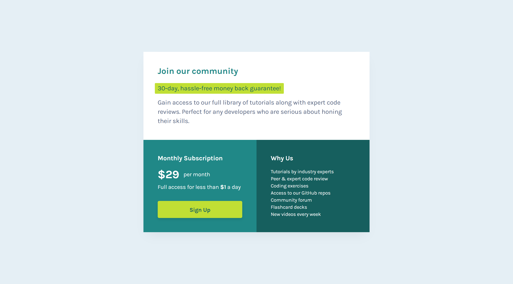

## Frontend Mentor - Single price grid component solution

This is a solution to the [Single price grid component challenge on Frontend Mentor](https://www.frontendmentor.io/challenges/single-price-grid-component-5ce41129d0ff452fec5abbbc). Frontend Mentor challenges help you improve your coding skills by building realistic projects.

<p>
  <a href="https://www.frontendmentor.io/solutions/pixel-perfect-with-html-and-css-OIXkcxB8sY">
    </a>
  <a href="https://haquanq-frontendmentor.github.io/single-price-grid-component/">
    </a>
  <a href="./LICENSE"
    ></a>
</p>

## Table of contents

- [Project overview](#sunrise-project-overview)
- [Development workflow](#stars-development-workflow)
- [Working in this repository](#astronaut-working-in-this-repository)

## :sunrise: Project overview

### Challenge equirements

- View the optimal layout for the component depending on their device's screen size
- See a hover state on desktop for the Sign Up call-to-action

### Todo

Accessibility

- [x] Improve contrast for better readability
- [x] Responsive accross different screen sizes
- [x] Interactive elements have clear focus indicator

### Preview



## :stars: Development workflow

### Approach

Site built with mobile-first workflow to prioritize mobile devices, made accessible using [ARIA Authoring Practices Guide (APG)](https://www.w3.org/WAI/ARIA/apg/).

### Tools

- **HTML + CSS:** vanilla CSS for styling.
- **Browsersync:** live development server (sync files changes).

### Deployment

- Deployed on github page using Github Actions (manually triggered).

## :astronaut: Working in this repository

### Presequisites

Having these tools installed:

- Git (prefer lastest LTS version)
- NodeJS (prefer latest LTS version)

### Clone this project to your machine

Open new terminal, run the following command:

```
git clone https://github.com/haquanq-frontendmentor/single-price-grid-component.git
```

Then, run `npm install` to install all dependencies.

```
npm install
```

### Start development server

In terminal, run `npm run dev` to start development server:

```
npm run dev
```
